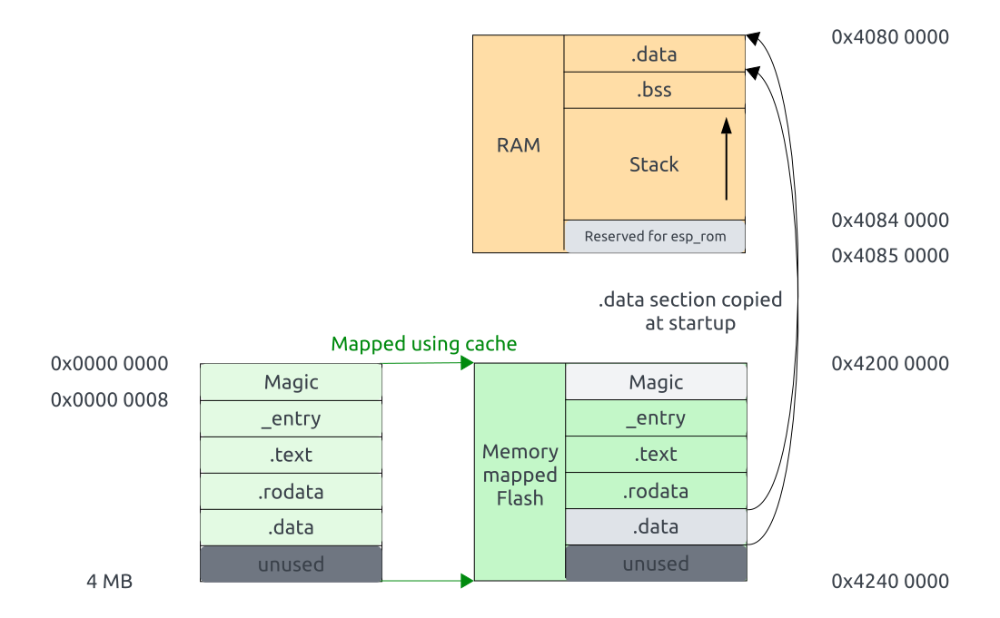

# Direct Boot example

Supported chips: ESP32-C3, ESP32-H2

This is an example of "direct boot" feature.
It allows an application to be executed directly from flash, without using the 2nd stage bootloader.

## Background

ESP8266 and ESP32 series of chips share the common [binary image format](https://docs.espressif.com/projects/esptool/en/latest/esp32/advanced-topics/firmware-image-format.html). This format describes how the binary image stored in flash should be loaded into IRAM/DRAM by the ROM bootloader. In typical applications, the ROM bootloader doesn't load the application binary directly. Instead, it loads the 2nd stage bootloader into RAM. The 2nd stage bootloader then loads the application: sections which should reside in RAM are copied from flash into RAM, and cache MMU is configured to map the remaining sections, which are accessed from flash.

Compared to other microcontrollers, where the program in flash is executed directly without the need for additional stages of bootloaders, this arrangement does add complexity. However, it should be noted that in most production applications the 2nd stage bootloader is required to support firmware update, rollback, and security features. Because of this, the 2nd stage bootloader is used in ESP-IDF, despite the extra complexity.

## Direct boot feature

Chips, supported in this example (for example, ESP32-C3, starting from silicon revision 3) allow an application stored in flash to be executed directly, without being copied into RAM. This makes it possible to link an application with a relatively simple linker script, and produce the binary using `objcopy` command, then flash the resulting binary to the target chip.

Direct boot feature is activated under the following conditions:
* Secure boot is disabled.
* Direct boot feature is not disabled via `EFUSE_DIS_LEGACY_SPI_BOOT` eFuse bit.
* The ROM bootloader doesn't detect a valid binary image [in the usual format](https://github.com/espressif/esptool/wiki/Firmware-Image-Format)
* The first 8 bytes in flash are `1d 04 db ae 1d 04 db ae` — that is a "magic number" 0xaedb041d repeated twice.

In this case, the ROM bootloader sets up Flash MMU to map all amount of Flash then jumps to address `Flash address + 8`, i.e. to the instruction at offset 8 in flash, immediately after the magic numbers.

For example, the ROM bootloader of ESP32-C3 sets up Flash MMU to map 4 MB of Flash to addresses 0x42000000 (for code execution) and 0x3C000000 (for read-only data access).

The application entry function needs to:
1. set up global pointer register
2. set up stack pointer register
3. zero-initialize the .bss section
4. initialize the .data section, copying it from ROM
5. write the vector table address to the MTVEC register (optional)
6. call C library initialization (optional)
7. call the `main` function

The `_start` function provided by newlib C library performs all these steps, except for the .data section initialization.

## When to use direct boot?

Direct boot feature is provided primarily to simplify the initial porting process of new languages, frameworks, and execution environments.

Use it if all of the below are true:

* ESP-IDF environment can't be used.
* The code doesn't fit into RAM, therefore execution from flash is required.
* Dependency on the ESP-specific binary image format or the ESP-IDF 2nd stage bootloader is undesirable.

This feature can also be useful in an educational context to "hide" the added complexity of chip Flash MMU and cache configuration.

## Alternatives to direct boot

If the entire application code is small enough to fit into RAM, then the direct boot feature is not required. Instead, the ELF file can be loaded into the chip using one of the following methods:

* With GDB `load` command, over JTAG.
* With `esptool.py load_ram` command, over UART.
* By converting the ELF file to binary using `esptool.py elf2image` and then writing the binary into flash.

## Example overview

This example contains the following parts:

* [common/](common/) directory with the application entrypoint, placeholder for the vector table, and a simple implementation of `_write` syscall.
* [examples/blink/](examples/blink/) directory with an example project which blinks an LED.
* [examples/hello_world/](examples/hello_world/) directory with the minimal example project which prints "Hello, world!" to the UART.
* [img/](img/) directory with *.svg format diagrams which illustrate the run-time memory layout and binary image layout when direct boot is used.
* [ld/](ld/) directory with the linker scripts.


## Prerequisites

### Cross-compiler

Download and install `riscv-none-elf-gcc` toolchain, for example from the [xPack project](https://github.com/xpack-dev-tools/riscv-none-elf-gcc-xpack/releases).

This example has been built and tested with toolchain release `12.2.0-3`.

Make sure the toolchain is added to your `PATH`.

A different RISC-V toolchain can also be used, in this case you need to adjust [toolchain-rv32.cmake](toolchain-rv32.cmake).

### Build tools

This example uses CMake. Make sure that CMake and your build system of choice (e.g., Ninja or GNU Make) are also added to your `PATH`.

### esptool.py

To flash binaries into the chip, [esptool.py](https://github.com/espressif/esptool) is used.

If you have Python and pip installed, you can install esptool using:
```bash
pip install --user esptool
```

Windows users may alternatively download a pre-built executable from the [releases](https://github.com/espressif/esptool/releases) page. These executables don't require Python to be installed.

## Building and running the examples

See README.md files in example directories for instructions:
* [blink](examples/blink/README.md)
* [hello_world](examples/hello_world/README.md)

## Debugging using JTAG and GDB

To debug the examples using JTAG and GDB, follow these steps:

1. Install OpenOCD from https://github.com/espressif/openocd-esp32/releases. (At the time of writing, the upstream version of OpenOCD includes Espressif Xtensa-based chips, but not RISC-V ones, yet.)
2. Add openocd to `PATH`
3. Build one of the examples (for instance, `blink`), then launch GDB like this:
   ```
   riscv-none-elf-gdb -x gdbinit build/blink
   ```
   This will use the provided gdbinit file to:
   - Launch OpenOCD in pipe mode. Adjust the `gdbinit` file if you need to change OpenOCD launch configuration or select another target chip. You can also launch OpenOCD manually, in that case use `target extended-remote :3333` in `gdbinit`.
   - Flash the program over JTAG
   - Reset the target
   - Set a temporary breakpoint at `main`
   - Run until the breakpoint
4. Now you can use GDB commands to step through the code as usual.

## Memory layout

### ESP32-C3

The sections shown in blue on the left are parts of the flash image.


ROM bootloader maps the 0 – 4 MB region of flash to the CPU address space twice: to the "DROM" region using the data cache, and to the "IROM" region using the instruction cache.

As it is obvious from the diagram, some parts of this mapping are unnecessary. These parts are shown in gray on the right. For example, `.text` section gets mapped not only to the IROM, but also to DROM, even though code execution only happens through IROM.

Such uniform mapping was chosen simply because it is universal, and can be set up by the ROM code without any prior knowledge about the application being loaded. This mapping isn't in any way a limitation of ESP32-C3 cache hardware; for example, ESP-IDF 2nd stage bootloader maps only those regions which are necessary in the given part of the address space.

The run-time memory layout and flash binary image layout shown above are achieved in the linker script ([ld/esp32c3/common.ld](ld/esp32c3/common.ld)) by specifying the LMAs (load addresses). LMAs start at 0, and match the addresses in flash. VMAs for IROM (`entry` and `.text`) and DROM (`.rodata`) sections are set in such a way that LMA == VMA - BASE, where *BASE* is the starting address of IROM or DROM. Non-cached `.data` section is then added at the next available LMA.

### ESP32-H2



ROM bootloader maps the 0 – 4 MB region of flash to the CPU address space using the cache and the Flash MMU.

The memory layout can be found in liker script ([ld/esp32h2/memory.ld](ld/esp32h2/memory.ld)).

The run-time memory layout and flash binary image layout shown above are achieved in the linker script ([ld/esp32h2/common.ld](ld/esp32h2/common.ld)) by specifying the LMAs (load addresses). LMAs start at 0, and match the addresses in flash. VMAs for ROM (`entry`, `.text` and `.rodata`) section is set in such a way that LMA == VMA - BASE, where *BASE* is the starting address of ROM. Non-cached `.data` section is then added at the next available LMA.