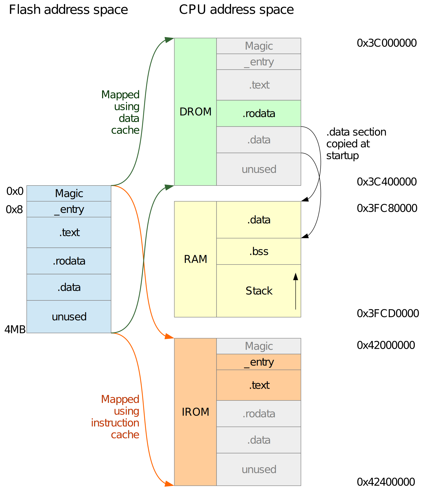

# ESP32-C3 Direct Boot example

This is an example of ESP32-C3 "direct boot" feature. It allows an application to be executed directly from flash, without using the 2nd stage bootloader.

## Background

ESP8266 and ESP32 series of chips share the common [binary image format](https://github.com/espressif/esptool/wiki/Firmware-Image-Format). This format describes how the binary image stored in flash should be loaded into IRAM/DRAM by the ROM bootloader. In typical applications, the ROM bootloader doesn't load the application binary directly. Instead, it loads the 2nd stage bootloader into RAM. The 2nd stage bootloader then loads the application: sections which should reside in RAM are copied from flash into RAM, and cache MMU is configured to map the remaining sections, which are accessed from flash.

Compared to other microcontrollers, where the program in flash is executed directly without the need for additional stages of bootloaders, this arrangement does add complexity. However, it should be noted that in most production applications the 2nd stage bootloader is required to support firmware update, rollback, and security features. Because of this, the 2nd stage bootloader is used in ESP-IDF, despite the extra complexity.

## Direct boot in ESP32-C3

ESP32-C3 (starting from silicon revision 3) allows an application stored in flash to be executed directly, without being copied into RAM. This makes it possible to link an application with a relatively simple linker script, and produce the binary using `objcopy` command, then flash the resulting binary to the ESP32-C3.

Direct boot feature is activated under the following conditions:
* Secure boot is disabled.
* Direct boot feature is not disabled via `EFUSE_DIS_LEGACY_SPI_BOOT` eFuse bit.
* The ROM bootloader doesn't detect a valid binary image [in the usual format](https://github.com/espressif/esptool/wiki/Firmware-Image-Format)
* The first 8 bytes in flash are `1d 04 db ae 1d 04 db ae` — that is a "magic number" 0xaedb041d repeated twice.

In this case, the ROM bootloader sets up Flash MMU to map 4 MB of Flash to addresses 0x42000000 (for code execution) and 0x3C000000 (for read-only data access). The bootloader then jumps to address 0x42000008, i.e. to the instruction at offset 8 in flash, immediately after the magic numbers.

The application entry function needs to:
1. set up global pointer register
2. set up stack pointer register
3. zero-initialize the .bss section
4. initialize the .data section, copying it from ROM
5. write the vector table address to the MTVEC register (optional)
6. call C library initialization (optional)
7. call the `main` function

The `_start` function provided by newlib C library performs all these steps, except for the .data section initialization.

## When to use direct boot?

Direct boot feature is provided primarily to simplify the initial porting process of new languages, frameworks, and execution environments.

Use it if all of the below are true:

* ESP-IDF environment can't be used.
* The code doesn't fit into RAM, therefore execution from flash is required.
* Dependency on the ESP-specific binary image format or the ESP-IDF 2nd stage bootloader is undesirable.

This feature can also be useful in an educational context to "hide" the added complexity of ESP32-C3 Flash MMU and cache configuration.

## Alternatives to direct boot

If the entire application code is small enough to fit into RAM, then the direct boot feature is not required. Instead, the ELF file can be loaded into the chip using one of the following methods:

* With GDB `load` command, over JTAG.
* With `esptool.py load_ram` command, over UART.
* By converting the ELF file to binary using `esptool.py elf2image` and then writing the binary into flash.

## Example overview

This example contains the following parts:

* [common/](common/) directory with the application entrypoint, placeholder for the vector table, and a simple implementation of `_write` syscall.
* [ld/](ld/) directory with the linker scripts.
* [examples/hello_world/](examples/hello_world/) directory with the minimal example project.

## Building and running the example

1. Download and install `riscv-none-embed-gcc` toolchain, for example from the [xPack project](https://xpack.github.io/riscv-none-embed-gcc/). Make sure the toolchain is added to your `PATH`.
   A different RISC-V toolchain can also be used, in this case you need to adjust [toolchain-rv32.cmake](toolchain-rv32.cmake).
2. Build the hello_world project with CMake:
   ```bash
   cd examples/hello_world
   mkdir build
   cd build
   cmake ..
   cmake --build .
   ```
   You should get the following output at the end:
   ```
   [2/3] Generating hello_world.bin
   copy from `hello_world' [elf32-littleriscv] to `hello_world.bin' [binary]
   [3/3] Running utility command for hello_world-size
   text	   data	    bss	    dec	    hex	filename
   5092	    136	    160	   5388	   150c	hello_world
   ```
   The following files will be generated:
   - `hello_world` — ELF output file
   - `hello_world.bin` — binary file for flashing into the chip
   - `hello_world.map` — linker map file
3. Flash the example using [esptool](https://pypi.org/project/esptool/):
   ```bash
   esptool.py --port /dev/ttyUSB0 --baud 921600 write_flash 0x0000 hello_world.bin
   ```
   (Adjust the serial port name as needed.)
4. See the serial output, for example using `miniterm.py` (assuming `pyserial` is installed):
   ```bash
   python -m serial.tools.miniterm /dev/ttyUSB0 115200
   ```
   You should see the following output:
   ```
   ESP-ROM:esp32c3-api1-20210207
   Build:Feb  7 2021
   rst:0x1 (POWERON),boot:0xc (SPI_FAST_FLASH_BOOT)
   Hello, world!
   ```
   The output will keep repeating with reset reasons such as `TG0WDT_SYS_RST`, `RTCWDT_RTC_RST` — this is because this example doesn't disable or feed the hardware watchdog timers.

## Memory layout

The following diagram illustrates the run-time memory layout and binary image layout when direct boot is used.



The sections shown in blue on the left are parts of the flash image.

ROM bootloader maps the 0 – 4 MB region of flash to the CPU address space twice: to the "DROM" region using the data cache, and to the "IROM" region using the instruction cache.

As it is obvious from the diagram, some parts of this mapping are unnecessary. These parts are shown in gray on the right. For example, `.text` section gets mapped not only to the IROM, but also to DROM, even though code execution only happens through IROM.

Such uniform mapping was chosen simply because it is universal, and can be set up by the ROM code without any prior knowledge about the application being loaded. This mapping isn't in any way a limitation of ESP32-C3 cache hardware; for example, ESP-IDF 2nd stage bootloader maps only those regions which are necessary in the given part of the address space.

The run-time memory layout and flash binary image layout shown above are achieved in the linker script ([ld/common.ld](ld/common.ld)) by specifying the LMAs (load addresses). LMAs start at 0, and match the addresses in flash. VMAs for IROM (`entry` and `.text`) and DROM (`.rodata`) sections are set in such a way that LMA == VMA - BASE, where *BASE* is the starting address of IROM or DROM. Non-cached `.data` section is then added at the next available LMA.